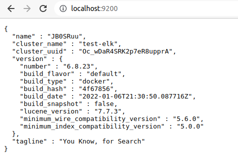
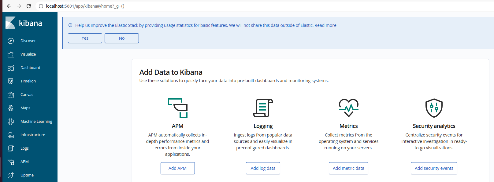
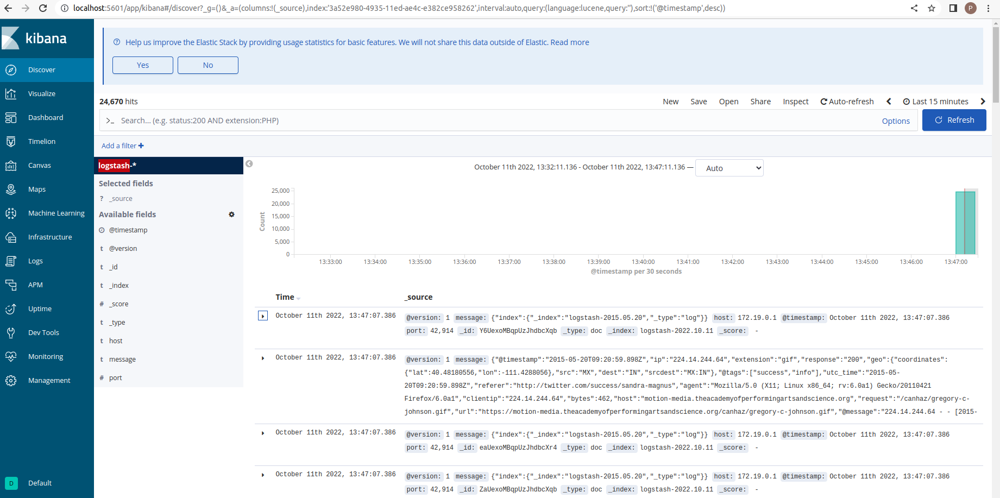

# ELK stack setup using docker containers

## Pre-requisities

- docker
- docker-compose

**Note** makesure you have following components installed already.

## setting up elk stack

clone the code using below commands.

```
git clone https://github.com/purushothamkdr453/docker-elk.git
cd docker-elk
docker-compose up -d
```

**Note** last command(docker-compose up -d) will take sometime because it pulls the elasticsearch, kibana, logstash images

you can verify the elk stack containers using below command.

```
docker ps -a
```

Elasticsearch exposes rest api at port 9200
Elasticsearch nodes communicate at port  9300
Kibana exposes the at port 5601
logstash listens at port 5000

you can access the elasticsearch rest api at port 9200 http://<ipaddress>:9200

Replace ipaddress with your host ip(not container ip)



you can access the kibana at port 5601 http://<ipaddress>:5601

Replace ipaddress with your host ip(not container ip)



Lets create index pattern for logstash using below command.

```
curl -XPOST -D- 'http://localhost:5601/api/saved_objects/index-pattern' -H 'Content-Type: application/json' -H 'kbn-version: 6.8.23' -d '{"attributes":{"title":"logstash-*","timeFieldName":"@timestamp"}}'
```

## Sending logs to elastisearch via logstash

Lets download sample logs from https://download.elastic.co/demos/kibana/gettingstarted/logs.jsonl.gz

Execute the below commands.

```
gunzip logs.jsonl.gz
cat logs.jsonl | nc localhost 5000
```

Now we can see the logs hitting kibana



You can also look at new index create by hitting the following endpoint - http://<ipaddress>:9200/_cat/indices?pretty

**Note** replace <ipaddress> with your host ip address
A
A
A
A
A
A
A
A
A
A
A
A
A

